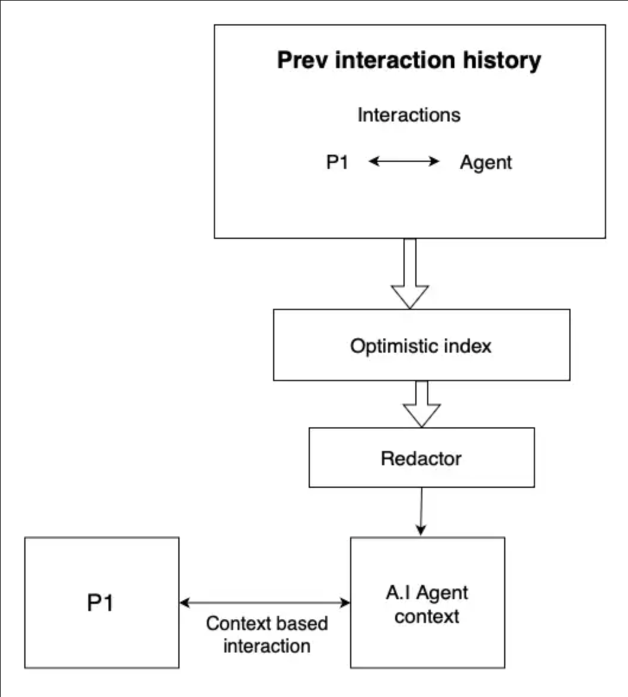
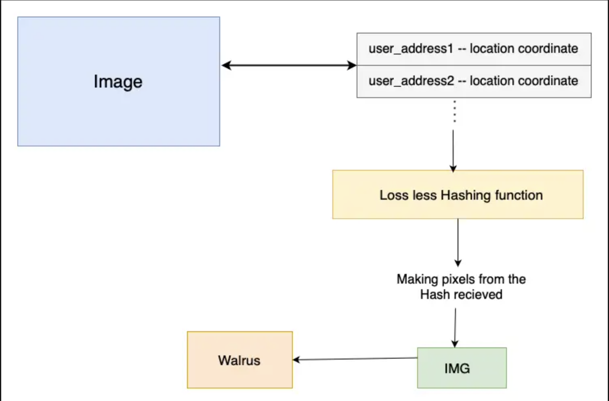
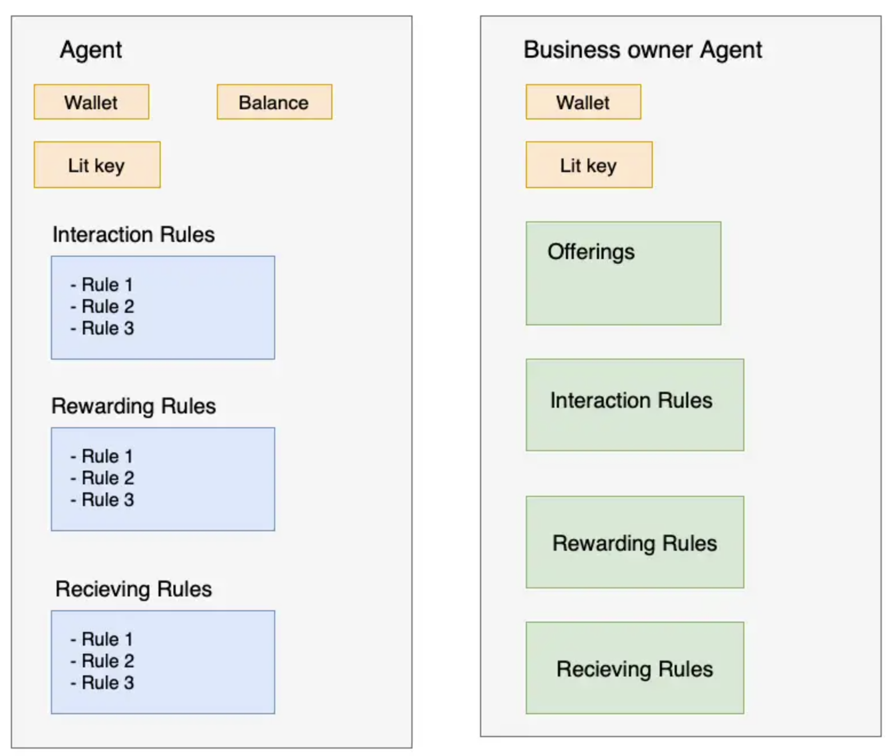
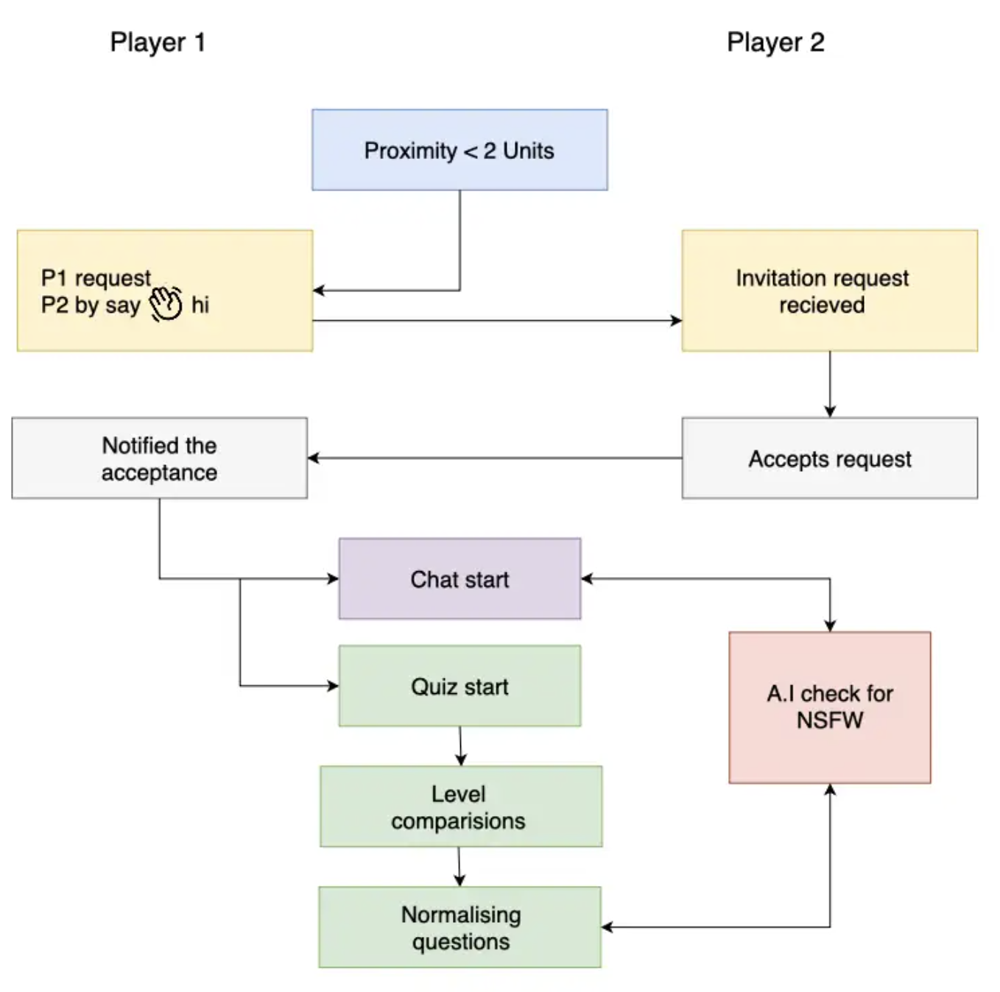

# Decentralized Cross-Chain Multiplayer Matrix

## Overview

The **Decentralized Cross-Chain Multiplayer Matrix** is a blockchain-based multiplayer platform that allows players from multiple blockchain networks to interact within a shared global map. Each chain has its own local contract, which stores player-specific data, while the global contract maintains the shared game map and ensures consistent synchronization of player data across chains.

### Key Features

- **Cross-Chain Integration**: Players can join the game from any supported blockchain.
- **Global Map Management**: A unified map is stored on the global contract, accessible to all players regardless of their chain of origin.
- **Player Proximity & Interaction**: Players can interact with others near their in-game location, even if they are on different chains.
- **Efficient Data Handling**: Each chain stores minimal player data, while global data is maintained on the main contract.
- **Secure Communication**: Chat requests and messages between players ensure proximity-based validation and consent.

---

## Contracts

### 1. **Global Contract**

The global contract handles shared data and game logic across all chains. It includes:

- A global map with player locations.
- Logic for player interactions such as chatting and proximity detection.
- Functions to manage cross-chain updates and synchronization.

### 2. **Local Chain Contract**

Each chain has a local contract that handles:

- Player registration for that specific chain.
- Minimal storage of player data such as their chain ID and address.
- Relaying updates to the global contract when a player moves or interacts.

---

## Goals

- To enable a truly decentralized and cross-chain multiplayer gaming experience.
- To ensure scalability by delegating localized operations to individual chains while maintaining global consistency.
- To promote interoperability between different blockchain ecosystems.

---

## Use Cases

### 1. **Cross-Chain Gaming**

A player joins from Chain A, while another joins from Chain B. Both can interact on the same global map, ensuring a seamless gaming experience.

### 2. **Proximity-Based Interaction**

Players in close proximity on the map can initiate chats, trade virtual assets, or engage in cooperative missions.

### 3. **Dynamic Map Updates**

As players move across the map, their locations are updated globally, allowing real-time interactions irrespective of their originating chain.

### 4. **Decentralized Communication**

Chat requests are validated based on player proximity, ensuring secure and meaningful interactions.

---

## How It Works

### Player Registration

1. A player registers on their local chain contract with minimal data.
2. The local contract relays their existence to the global contract, updating their presence on the global map.

### Game Map Management

- The global contract maintains a single map where all players' positions are stored.
- Players from any chain can view and interact with this map.

### Communication Between Chains

- The global contract serves as the central point for data exchange, ensuring that updates from local chains are reflected globally.
- Local contracts ensure data is efficiently managed within their respective chains.

---

###**Interaction History and Optimistic Index**

# Example Section

- **Purpose**: Tracks the history of interactions and their context.
- **Key Components**:
- Interaction data flows through an "Agent."
- The system includes a redactor for refining and contextualizing interactions.
- The "Optimistic Index" maintains a reference for processing outcomes.
- **Flow**:
- Interaction data is processed by the agent, influenced by the Optimistic Index, and contextualized before being stored.

###**Image Processing with Lossless Hashing**

- **Purpose**: Converts user location data into image representations using hashing.
- **Key Components**:
- Input data includes:
- `user_address1` and `user_address2` (with location coordinates).
- A lossless hashing function transforms input data into hash values.
- Hash values are converted into image pixels to create a visual representation.
- **Flow**:
- User data → Hashing function → Image creation.

###**Interaction and Rewarding Rules**

- **Purpose**: Governs how interactions are structured and rewards are distributed.
- **Key Components**:
- **Agents**:
- Business owner agents.
- **Rules**:
- Interaction rules, receiving rules, and rewarding rules.
- **Offerings**:
- Business owners offer services or products based on predefined rules.
- **Flow**:
- Agents follow predefined interaction and rewarding rules to offer and reward services.

###**Base Optimism**

- **Purpose**: Represents the foundational optimism used in decision-making and interaction flows.
- **Flow**: Acts as the core layer that supports optimistic decision-making across processes.

---

## Future Enhancements

- **NFT Integration**: Players can trade or display NFTs as in-game assets.
- **Cross-Chain Asset Transfer**: Enable players to move assets or rewards between chains.
- **Custom Maps**: Allow community-generated maps with unique gameplay mechanics.

---

## Development Notes

### Key Challenges Addressed

1. **Cross-Chain Consistency**: Synchronization between local and global contracts ensures data accuracy.
2. **Efficient Storage**: Player data is minimized at the local level to reduce storage costs.
3. **Secure Interactions**: Chat and location-based features validate player states for secure gameplay.

---

## Contributions

We welcome contributions to improve scalability, interoperability, and player experiences. Please refer to our [contribution guide](#) for details.

---

### License

This project is licensed under the **GPL-3.0 License**.

---

**Let’s build the future of cross-chain decentralized gaming together!**

Contracts Deployed on :

Socket OffchainVM :

- MatrixDeployer: 0x86AFF9fDE176247fA09Dc8f1b691DB8C9318282b
- GlobalMatrixGateway: 0x26EBbDA4c2ee4C7f8FD83D2df1a35247F0Ec18C3
